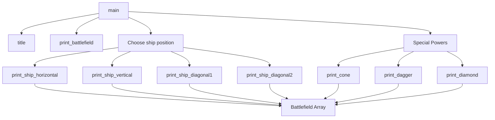

# Battleship

A simple naval battle simulator made in C for a college programming challenge.

This project was created to practice navigation, nested loops and conditional structures using bidimensional arrays.

Original repository: [desafio-batalha-naval-sabrigs-3](https://github.com/Cursos-TI/desafio-batalha-naval-sabrigs-3)

## Features

- 10x10 battlefield
- Horizontal, vertical and diagonal ships
- Position validation
- Collision detection
- Special attack areas
    - Cone
    - Dagger
    - Diamond

## Code structure

